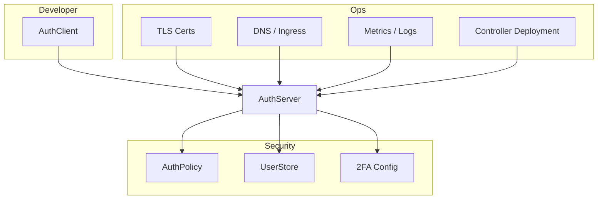

**Nauthera** is a modern, Kubernetes-native authentication management solution that simplifies the configuration and lifecycle of OpenID Connect (OIDC) clients and authentication flows. Leveraging an **operator-based approach**, Nauthera provides automation, governance, and self-service—all while enforcing robust security policies and reducing cognitive load for developers and platform teams.

Whether you're a homelab tinkerer, a fast-moving startup, or an enterprise platform team, Nauthera helps you scale authentication securely and efficiently in a Kubernetes-native way.

## Architecture

## Key Advantages

### **1. Kubernetes-Native Design**

- **CRD-Based Authentication Clients**: OIDC client configurations are first-class Kubernetes resources. No more external dashboards or hardcoded secrets.
- **Namespace Isolation**: Keep client definitions and scopes cleanly separated per namespace to enable true multi-tenancy.
- **Built-In RBAC**: Leverage Kubernetes RBAC to delegate client configuration to teams securely and precisely.

### **2. Operator-Based Automation**

- **Full Lifecycle Management**: Nauthera's operator automates the creation, update, and cleanup of OIDC clients across identity providers.
- **Reconciliation & Drift Detection**: Continuously monitors for divergence between declared state and actual state—ensuring system integrity even in the face of manual tampering or provider issues.
- **GitOps Native**: Change once in Git, and the operator ensures everything is synced—perfect for CI/CD pipelines and platform engineering.

### **3. Developer-Centric Self-Service**

- **Frictionless Onboarding**: Developers define their auth needs via YAML. Nauthera takes care of the rest—no support tickets, no guesswork.
- **Reusable Templates**: Share reusable client templates with defaults, reducing duplication and enforcing organizational best practices.
- **Instant Feedback**: Failed policies? Misconfigured scopes? Developers get instant Kubernetes feedback through CRD status and events.

### **4. Enterprise-Grade Security**

- **Admission Controls**: All client resources are validated before creation using admission webhooks that enforce org-wide rules.
- **Dynamic Claims from LDAP/AD**: Populate user claims in tokens with real-time data from Active Directory or LDAP sources.
- **Compliance-Ready Auditing**: Every change to auth clients is tracked via Kubernetes events and Git history—aligns with SOC 2, ISO 27001, and other frameworks.

### **5. Flexible & Extensible Authentication**

- **Federated Identity Support**: Integrate easily with external IdPs (e.g., Google, Azure AD, GitHub, Okta, or custom SAML IdPs).
- **Protocol Extensibility**: While OIDC is first-class, the operator model allows the addition of other protocols (e.g., SAML, WS-Fed) via plugins or CRD extensions.
- **Branded UX**: Bring your own themes, consent screens, or login UX if needed, while keeping core logic managed declaratively.

### **6. Scalable, Future-Proof Architecture**

- **Cloud-Native at Its Core**: Designed for multi-cluster, multi-region environments with high client counts and minimal operator overhead.
- **Loosely Coupled**: Integrates with any ingress controller or service mesh (Istio, Linkerd, Traefik, etc.).
- **Open Source Core, Enterprise-Ready Extensions**: Start with community-driven features, then layer in advanced capabilities like analytics, audit trails, or enterprise SSO brokering.

## Why Nauthera Over Traditional Tools?

### Compared to Keycloak and Similar Platforms

Here’s a comparable table extending the comparison to **Ory**, **Dex**, and **others**, focusing on Kubernetes-native, declarative, and GitOps-friendly auth platforms:

| Feature              | Keycloak              | Ory                                    | Dex                        | Nauthera                   |
| -------------------- | --------------------- | -------------------------------------- | -------------------------- | -------------------------- |
| Kubernetes Native    | ❌ Add-on             | ⚠️ Partial (via Kratos/Oathkeeper)     | ⚠️ Limited (static config) | ✅ First-class             |
| Declarative CRDs     | ❌ GUI/REST           | ⚠️ Some support (e.g. Keto)            | ❌ ConfigMap based         | ✅ YAML CRDs               |
| GitOps Compatibility | ⚠️ Manual integration | ⚠️ Scripted workflows                  | ⚠️ Not seamless            | ✅ Native                  |
| Multi-Tenancy        | 🚧 Requires effort    | ❌ Separate deploys required           | ❌ Not supported           | ✅ Built-in                |
| Operator Model       | ❌ Lacking            | ❌ Microservice orchestration required | ❌ None                    | ✅ Core design             |
| Extensibility        | ✅ SPI / Java         | ✅ Modular APIs                        | ⚠️ Limited                 | ✅ Kubernetes-native hooks |
| Developer UX         | ❌ Heavyweight        | ⚠️ Complex microservices               | ⚠️ Static and basic        | ✅ Lean and composable     |

**Notes:**

- **Ory** is powerful but fragmented — requires coordinating multiple services (Kratos, Hydra, Keto, Oathkeeper), which can be non-trivial operationally.
- **Dex** is lightweight but limited — no dynamic client registration, no user management, and configuration is typically static via ConfigMaps.
- **Keycloak** has lots of features but is a heavy Java-based monolith with a less-than-ideal Kubernetes story.
- **Nauthera** aims to simplify and modernize auth by making it **Kubernetes-native**, **declarative**, and **GitOps-first**, with a solid operator pattern and built-in multi-tenancy.

### Compared to Manual OIDC Configuration

- **No Terraform Glue or Manual Portals**: Nauthera handles the client lifecycle automatically with no need for brittle scripts or dashboards.
- **Governance and Guardrails**: Validate configurations before they go live. Ensure teams stay compliant without being blocked.
- **Fast Feedback Loops**: Developers iterate using Git and kubectl—not internal ticket queues.

## Use Cases

- 🧪 **Home Labs**: Secure Kubernetes apps at home with minimal setup.
- 🚀 **Startups**: Ship faster without compromising auth security.
- 🏢 **Enterprises**: Decentralize auth config safely across dozens of teams and environments.
