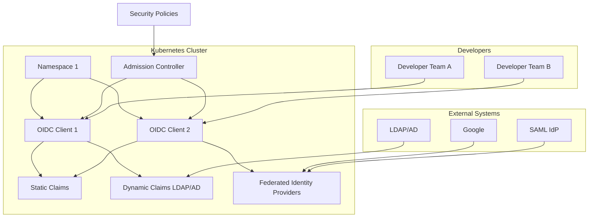

Nauthera is a modern, cloud-native authentication management solution that simplifies the configuration and management of OpenID Connect (OIDC) clients and authentication flows. Built on Kubernetes-native principles, Nauthera empowers development teams to manage their authentication needs seamlessly while adhering to organizational security policies.

## Key Advantages of Nauthera

### **1. Kubernetes-Native Design**
- **CRD-Based Configuration**: Manage authentication clients as Kubernetes Custom Resource Definitions (CRDs), integrating naturally with your existing Kubernetes workflows.
- **Namespace Isolation**: Allow multi-tenant environments by scoping client configurations to specific namespaces.
- **RBAC Integration**: Use Kubernetes Role-Based Access Control (RBAC) to manage permissions and enforce organizational policies.

### **2. Developer-Focused**
- **Customizable Claims**: Easily configure static and dynamic claims, including integration with LDAP/AD attributes.
- **Self-Service for Teams**: Empower development teams to create and manage clients without involving central IT, while staying within predefined security boundaries.
- **Rapid Iteration**: Leverage a GitOps-style workflow for defining, deploying, and testing authentication configurations.

### **3. Enterprise-Grade Security**
- **Policy Enforcement**: Use admission controllers to validate client configurations against organization-wide policies.
- **Dynamic Claims**: Populate claims dynamically from trusted sources like LDAP and AD.
- **Auditability**: Maintain logs of all changes for compliance and monitoring.

### **4. Flexible Authentication**
- **Protocol Support**: Built for OpenID Connect (OIDC), with potential for SAML and other custom protocols.
- **Custom Login Flows**: Support for branded login themes and user consent screens.
- **Federated Identity**: Seamlessly integrate with external identity providers like Google, Azure AD, and custom SAML IdPs.

### **5. Scalable and Future-Proof**
- **Cloud-Native Scalability**: Designed to scale with your Kubernetes clusters and handle large numbers of clients and requests.
- **Extensible**: Add support for new protocols, advanced token rules, or additional integrations as your needs grow.
- **Open Source Core**: Build trust and transparency by using the open-source base while offering enterprise features on top.

## Why Nauthera Over Alternatives?

### Keycloak and Similar Solutions
- **Modern Kubernetes Focus**: Unlike Keycloak and traditional platforms, Nauthera is built from the ground up to integrate with Kubernetes.
- **CRD-Based Workflow**: Avoid GUI-driven configurations; use Kubernetes-native CRDs for consistency and scalability.

### Manual OIDC Management
- **Automation and Governance**: Replace manual client configurations with automated CRDs, reducing errors and enforcing policies.
- **Self-Service**: Free up central IT by allowing developers to manage their own clients safely.

### Developer and Enterprise Alignment
- Nauthera bridges the gap between developers who want speed and security teams that need compliance, enabling both to work effectively within a unified system.

## Get Started with Nauthera
- [Documentation](#) to explore the full capabilities of Nauthera.
- [Quickstart Guide](#) to set up your first OIDC client in minutes.
- Join the [Community](#) to contribute, collaborate, and share feedback.

---

Nauthera is the future of cloud-native authentication management. Streamline your authentication workflows, improve security, and empower your teams with the power of Kubernetes. Ready to take the next step? Try Nauthera today!

