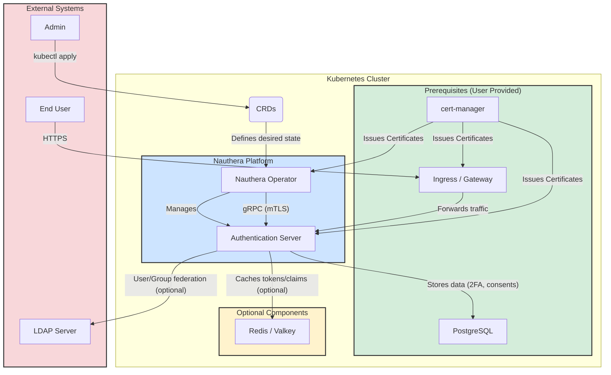

This document outlines the architecture of the Nauthera platform. The platform is designed to be a cloud-native, scalable, and secure authentication solution that runs on Kubernetes.

This section provides a detailed look into the different aspects of the platform's architecture:

*   **[Installation](./installation/)**: Describes the different deployment models.
*   **[Components](./components/)**: Details the core components of the platform.
*   **[Custom Resources](./crds/)**: Explains how to manage the platform declaratively.
*   **[Observability](./observability/)**: Covers metrics, logging, and tracing.
