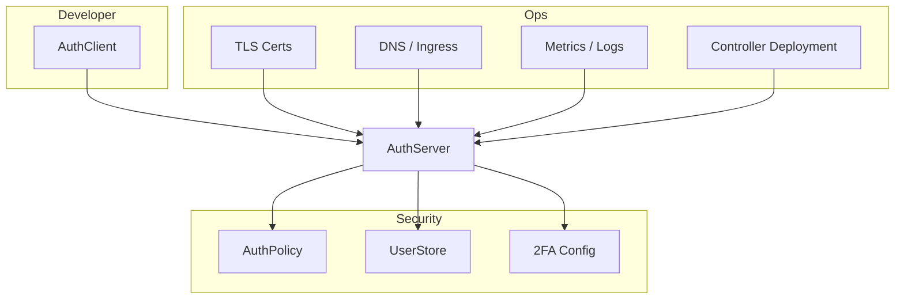
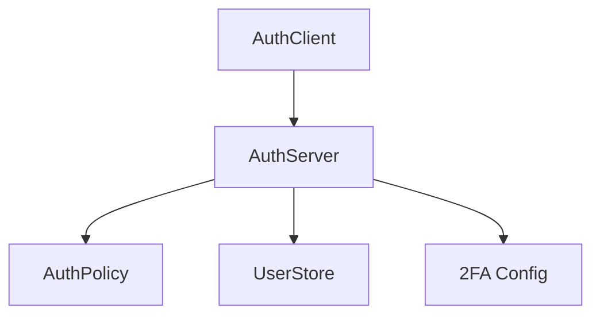

# Roles



| Team           | Controls                                               |
| -------------- | ------------------------------------------------------ |
| **Developers** | Create `AuthClient` to register applications           |
| **Security**   | Define `AuthPolicy`, `UserStore`, `2FA`, assign trust  |
| **Ops**        | Deploy & maintain `AuthServer`, TLS, observability, DR |

> Each team has their own set of CRDs, with **Kubernetes RBAC** enforcing separation and **GitOps** or similar workflows to control changes.


## CRD Relationships



## Example CRDs

```yaml
apiVersion: auth.nauthera.io/v1alpha1
kind: AuthClient
metadata:
  name: myapp-client
  namespace: myapp
spec:
  clientId: myapp
  authServerRef: prod-auth
  clientSecretRef:
    name: myapp-client-secret
  redirectUris:
    - https://myapp.example.com/callback
  grantTypes:
    - authorization_code
  responseTypes:
    - code
  scopes:
    - openid
    - email
  userGroupAccess:
    - developers
```

```yaml
apiVersion: auth.nauthera.io/v1alpha1
kind: AuthServer
metadata:
  name: prod-auth
  namespace: security
spec:
  issuerUrl: https://auth.prod.example.com
  environment: production
  trustDomain: example.com
  tokenEndpoint: /oauth/token
  authorizationEndpoint: /oauth/authorize
  jwksUri: /oauth/keys

  # Controlled by security team
  userStoreRef: corp-ldap
  authPolicyRef: strict-security
  tls:
    certSecretRef:
      name: auth-tls-cert
```

```yaml
apiVersion: auth.nauthera.io/v1alpha1
kind: AuthPolicy
metadata:
  name: strict-security
  namespace: security
spec:
  accessTokenTtl: 1800
  refreshTokenTtl: 43200
  idTokenTtl: 600
  allowedScopes:
    - openid
    - email
    - profile
  allowedGrantTypes:
    - authorization_code
    - refresh_token
  enforcePkce: true
  restrictToUserGroups:
    - developers
    - admins
  twoFactor:
    required: true
    methods:
      - totp
      - webauthn
```
