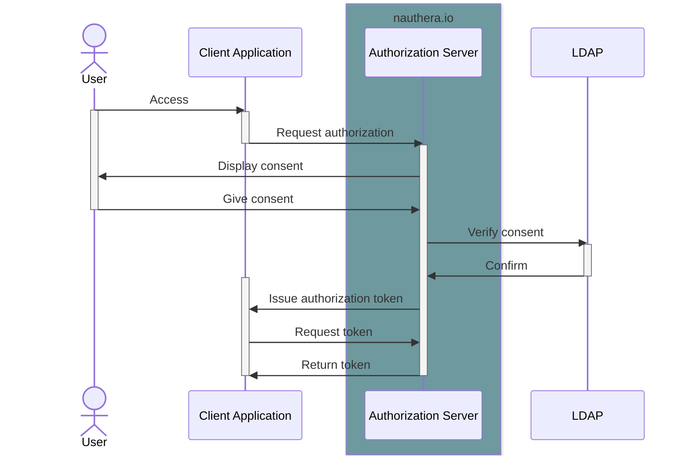
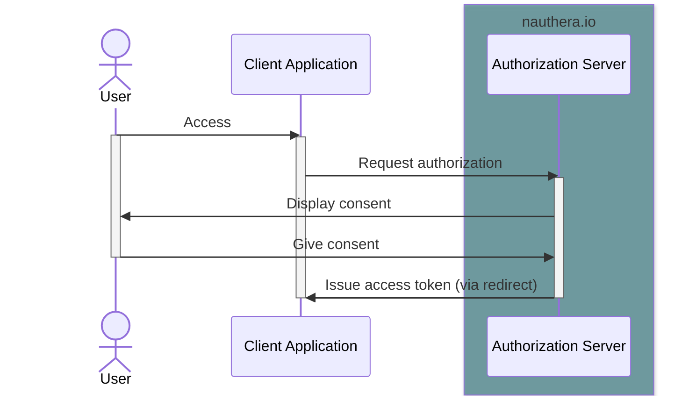
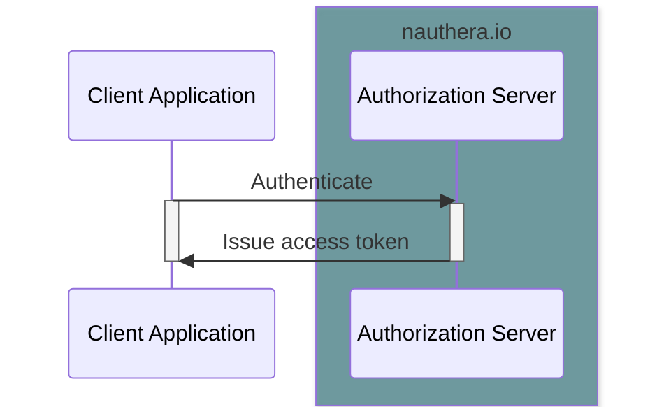
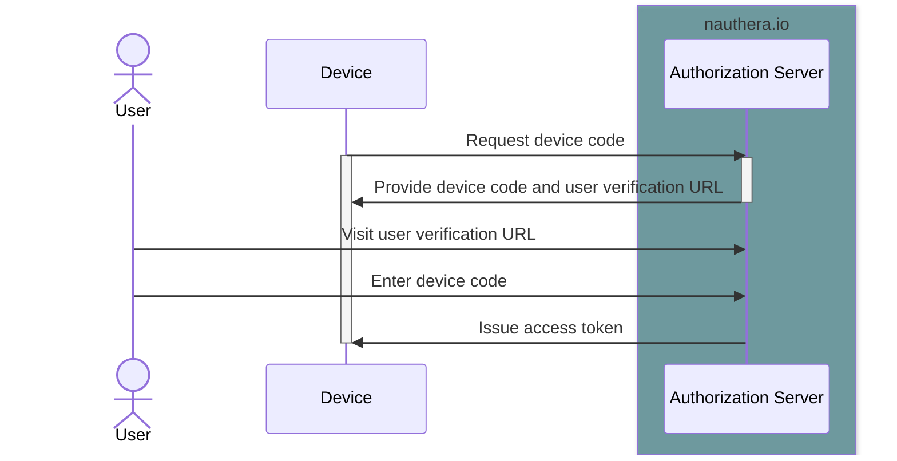
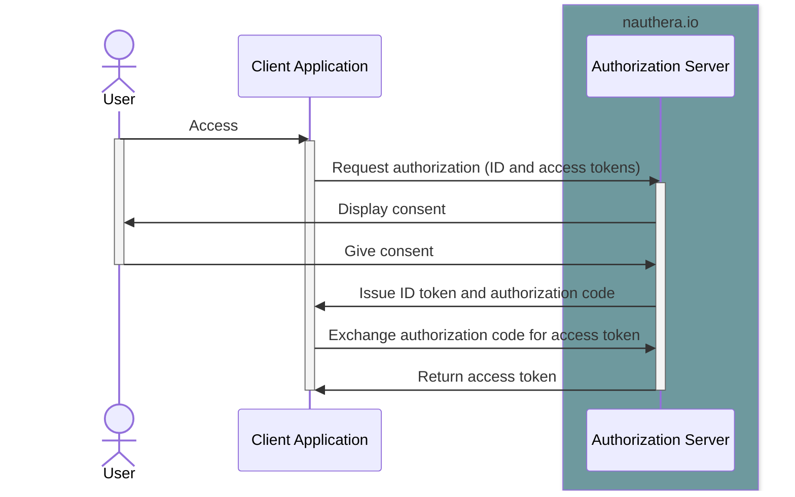

## Authorization Code

```mermaid
sequenceDiagram
    actor User
    participant Client Application
    box rgba(2,88,99,0.5) nauthera.io
        participant Authorization Server
    end
    participant LDAP

    User->>Client Application: Access
    activate User
    activate Client Application
    Client Application->>Authorization Server: Request authorization
    deactivate Client Application 

    activate Authorization Server
    Authorization Server->>User: Display consent
    User->>Authorization Server: Give consent
    deactivate User

    Authorization Server->>LDAP: Verify consent
    activate LDAP
    LDAP->>Authorization Server: Confirm
    deactivate LDAP

    activate Client Application
    Authorization Server->>Client Application: Issue authorization token
    Client Application->>Authorization Server: Request token
    Authorization Server->>Client Application: Return token
    deactivate Client Application

    deactivate Authorization Server
```

## Implicit Flow

```mermaid
sequenceDiagram
    actor User
    participant Client Application
    box rgba(2,88,99,0.5) nauthera.io
        participant Authorization Server
    end

    User->>Client Application: Access
    activate User
    activate Client Application
    Client Application->>Authorization Server: Request authorization

    activate Authorization Server
    Authorization Server->>User: Display consent
    User->>Authorization Server: Give consent
    deactivate User

    Authorization Server->>Client Application: Issue access token (via redirect)
    deactivate Authorization Server
    deactivate Client Application
```

## Client Credentials Flow

```mermaid
sequenceDiagram
    participant Client Application
    box rgba(2,88,99,0.5) nauthera.io
        participant Authorization Server
    end

    Client Application->>Authorization Server: Authenticate
    activate Client Application
    activate Authorization Server
    Authorization Server->>Client Application: Issue access token
    deactivate Authorization Server
    deactivate Client Application
```

## Device Code Flow

```mermaid
sequenceDiagram
    actor User
    participant Device
    box rgba(2,88,99,0.5) nauthera.io
        participant Authorization Server
    end

    Device->>Authorization Server: Request device code
    activate Device
    activate Authorization Server
    Authorization Server->>Device: Provide device code and user verification URL
    deactivate Authorization Server

    User->>Authorization Server: Visit user verification URL
    User->>Authorization Server: Enter device code
    Authorization Server->>Device: Issue access token
    deactivate Device
```

## Hybrid Flow (OIDC-specific)

```mermaid
sequenceDiagram
    actor User
    participant Client Application
    box rgba(2,88,99,0.5) nauthera.io
        participant Authorization Server
    end

    User->>Client Application: Access
    activate User
    activate Client Application
    Client Application->>Authorization Server: Request authorization (ID and access tokens)

    activate Authorization Server
    Authorization Server->>User: Display consent
    User->>Authorization Server: Give consent
    deactivate User

    Authorization Server->>Client Application: Issue ID token and authorization code
    Client Application->>Authorization Server: Exchange authorization code for access token
    Authorization Server->>Client Application: Return access token
    deactivate Authorization Server
    deactivate Client Application
```