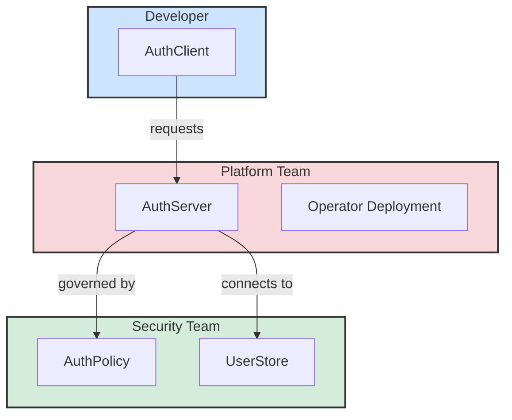

Nauthera is designed to meet the unique needs of different teams involved in the software development lifecycle. By providing a clear separation of concerns and a declarative, GitOps-native workflow, Nauthera empowers each team to work more effectively and securely.

This section explores the specific benefits and workflows for each role:

*   **[For Developers](./developers/)**: Learn how Nauthera enables developer self-service and reduces friction.
*   **[For Security Teams](./security/)**: Discover how to enforce robust, consistent security policies across your organization.
*   **[For Platform Teams](./platform-teams/)**: See how Nauthera simplifies the management of a scalable, cloud-native authentication platform.
